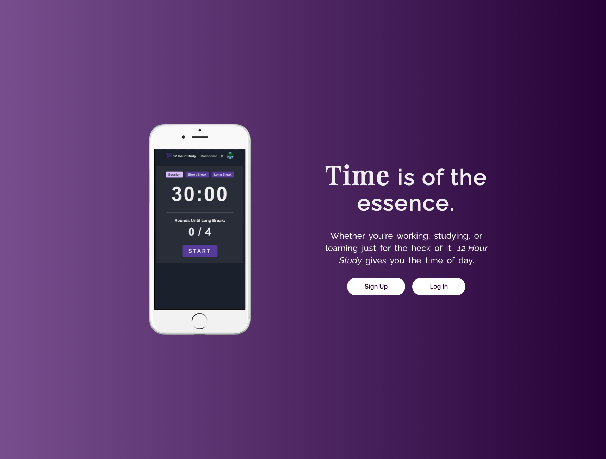

# 12 Hour Study

## Live Demo

- https://12hourstudy.netlify.app

## Summary

- **_12 Hour Study_** is a studying/productivity app that helps you stay focused and achieve a healthy work-break balance.
- It is comprised of a customizable Pomodoro timer which allows you to set your study session durations, as well as the durations of your short break and long break. It also lets you set how many study sessions are required before starting the long break (interval adjustment).
- The app generates weekly bar graph reports that display the amount of time you've studied.
- Other features include:
  - A profile page where you can upload and display your social media links.
  - Volume control and muting.
  - Dark mode.

## Background

Around the time the COVID-19 pandemic started, there was a surge in productivity advocacy on social media platforms, as a lot of people found the forced solitude as an opportunity to foster their existing skills or hone new ones.

At the same time, I noticed a rising trend on YouTube: so-called "study with me" videos, where the uploader films their study session in full, and which often featured on-screen pomodoro timers to let viewers know when the next break or study block was to occur. These videos would often be named "X hour study", with X representing the session duration in hours.

This gave me the inspiration I needed to build a new app that interested me and would challenge me to figure out effective solutions to new problems.

## Technologies Used

- [Node.js](https://github.com/nodejs/node)
- [Express.js](https://github.com/expressjs/express)
- [MongoDB](https://github.com/mongodb/mongo)
- [Create-React-App](https://github.com/facebook/create-react-app)
- [React-Redux](https://github.com/reduxjs/react-redux)
- [Nivo](https://github.com/plouc/nivo)
- [Chakra UI](https://github.com/chakra-ui/chakra-ui)

## Hosting Services

- [Netlify](https://www.netlify.com) (front-end)
- [Render](https://www.render.com) (back-end)
- [MongoDB Atlas](https://www.mongodb.com/atlas/database) (database)
